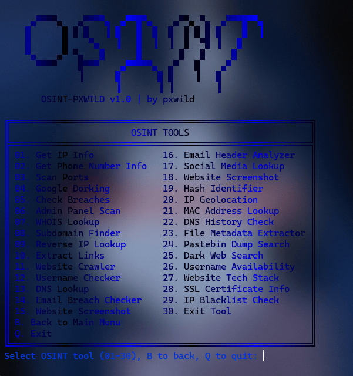
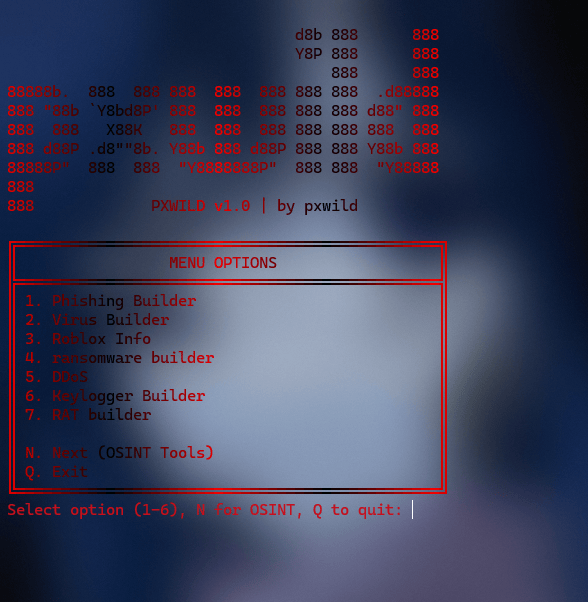

# pxwild Multi-Tool

*Created by pxwild*


## Overview

The **pxwild Multi-Tool** is a Python-based toolset for educational purposes only, designed to help users learn about cybersecurity in a controlled, ethical environment.

**⚠️ IMPORTANT DISCLAIMER**: The pxwild Multi-Tool is **100% for ethical, educational use only** and is **no joke**. This toolset is intended **solely for learning and research purposes** in controlled environments with explicit permission (e.g., personal systems or authorized testing labs). **Any use of this tool to harm, disrupt, or target any person, system, or network without explicit authorization is strictly forbidden and illegal**. Misuse of these tools violates the principles of this project, GitHub's policies, and applicable laws. By using this tool, you agree to act responsibly, ethically, and in compliance with all relevant regulations. The creator, **pxwild**, is not responsible for any misuse or damage caused by these tools. **Use at your own risk, and only with proper authorization**.

## Screenshots

| OSINT Tool | pxwild Multi-Tool |
|------------|-------------------|
|  |  |

## Installation

Install the required dependencies using:

```bash
pip install requests phonenumbers beautifulsoup4 exif python-whois googlesearch-python PyQt6 cryptography pyinstaller customtkinter pillow rich pyautogui opencv-python pynput psutil pywin32 colorama buildozer
```

## Usage

To start the tool, run:

```bash
python pxwild.py
```

## License

This project is licensed under the GNU General Public License. See the [LICENSE](LICENSE) file for details.
